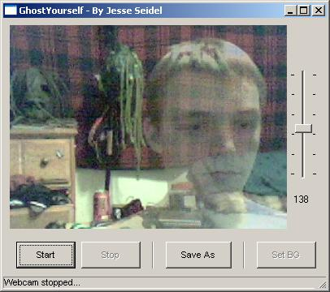



## GhostYourself \(Make yourself translucent using a webcam\!\) No joke\! \(Version 2\)

### Description

With this application you can actually make yourself translucent, and see right through yourself in real-time. Meaning it's like you really are a ghost! The code can generate the translucency very fast and therefore can keep up with the webcam refreshing every 50 millisenonds, appearing real-time. I came up with this idea after trying to come up with ideas of making some some use of green-screen technology, but it turned out to be this. This is the second upload of it, as I have made some minor changes to the code and added a status-bar as well as made it so you can select a location of your saved images, instead of it just saving to C:\temp.bmp. I have also commented almost every line of the code so you know what's going on all through the code. Also I have actually reduced the filesize of the ZIP from 22 KB to 5 KB, and there's more stuff in it... PLEASE leave lots of feedback if you look at this. I only submit things to keep Planet Source Code alive, and to see whatever everyone thinks about my ideas and what the end-results are. So PLEASE leave me lots of feedback on what you think. Enjoy everyone.
 
### More Info
 

             |
---                |---
**Submitted On**   |2005-01-04 21:44:08
**By**             |[Jesse Seidel \(Dr\. Fire\)](https://github.com/Planet-Source-Code/PSCIndex/blob/master/ByAuthor/jesse-seidel-dr-fire.md)
**Level**          |Advanced
**User Rating**    |5.0 (110 globes from 22 users)
**Compatibility**  |VB 6\.0
**Category**       |[Graphics](https://github.com/Planet-Source-Code/PSCIndex/blob/master/ByCategory/graphics__1-46.md)
**World**          |[Visual Basic](https://github.com/Planet-Source-Code/PSCIndex/blob/master/ByWorld/visual-basic.md)
**Archive File**   |[GhostYours183683152005\.zip](https://github.com/Planet-Source-Code/jesse-seidel-dr-fire-ghostyourself-make-yourself-translucent-using-a-webcam-no-joke-versio__1-58115/archive/master.zip)

